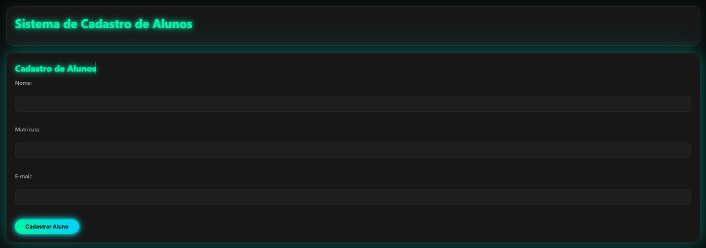
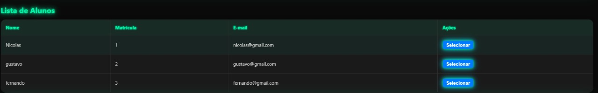
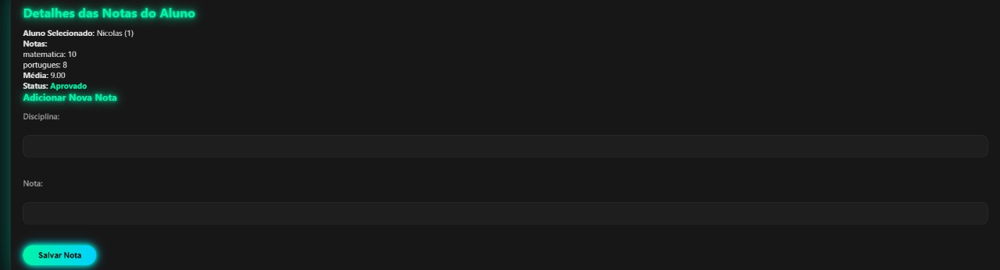

# Sistema de Cadastro de Alunos

Este projeto é um sistema web completo para cadastro de alunos e gerenciamento de notas, integrando **frontend em HTML/CSS/JavaScript** com um **backend em Python (Flask)** e banco de dados **Supabase**. O sistema permite cadastrar alunos, listar todos os alunos, selecionar um aluno para visualizar suas notas, adicionar novas notas e exibir automaticamente se o aluno está aprovado ou reprovado.

---

## Funcionalidades

- **Cadastro de Alunos:** Nome, matrícula e e-mail.
- **Listagem de Alunos:** Visualização de todos os alunos cadastrados.
- **Seleção de Aluno:** Seleciona um aluno para ver detalhes e notas.
- **Cadastro de Notas:** Adiciona notas por disciplina para o aluno selecionado.
- **Visualização de Notas:** Exibe todas as notas, a média e o status (Aprovado/Reprovado) do aluno selecionado.
- **Feedback Visual:** Mensagens de sucesso e erro para todas as ações.

---

## Tecnologias Utilizadas

- **Frontend:**  
  - HTML5  
  - CSS3  
  - JavaScript (ES6)

- **Backend:**  
  - Python 3  
  - Flask  
  - Flask-CORS  
  - Supabase (PostgreSQL gerenciado)  
  - python-dotenv

---

## Estrutura do Projeto

```
projeto javascript/
│
├── index.html         # Frontend da aplicação
├── main.py            # Backend Flask (API REST)
├── .env               # Variáveis de ambiente (chaves do Supabase)
└── README.md          # Este arquivo
```

---

## Como Executar o Projeto

### 1. Pré-requisitos

- Python 3 instalado
- Conta no [Supabase](https://supabase.com/) com as tabelas `aluno` e `nota` criadas

### 2. Instale as dependências do backend

No terminal, dentro da pasta do projeto:

```bash
pip install flask flask-cors supabase python-dotenv
```

### 3. Configure o Supabase

Crie um arquivo `.env` na raiz do projeto com o seguinte conteúdo (já incluso no seu projeto):

```
SUPABASE_URL=SEU_URL_DO_SUPABASE
SUPABASE_KEY=SUA_CHAVE_DO_SUPABASE
```

**Obs:** Use as credenciais do seu projeto no Supabase.

### 4. Estrutura das Tabelas no Supabase

- **Tabela `aluno`:**
  - `id` (integer, primary key, auto increment)
  - `nome` (text)
  - `matricula` (text)
  - `email` (text)

- **Tabela `nota`:**
  - `id` (integer, primary key, auto increment)
  - `aluno_id` (integer, foreign key para aluno.id)
  - `disciplina` (text)
  - `nota` (float)

### 5. Execute o backend

No terminal:

```bash
python main.py
```

O backend Flask estará rodando em [http://127.0.0.1:5000](http://127.0.0.1:5000).

### 6. Execute o frontend

Basta abrir o arquivo `index.html` no navegador.  
**Dica:** Use o Live Server do VS Code para evitar problemas de CORS.

---

## Fluxo de Funcionamento

1. **Cadastro de Aluno:**  
   Preencha o formulário e clique em "Cadastrar Aluno". O aluno será salvo no banco Supabase via API Flask.

2. **Listagem e Seleção:**  
   Todos os alunos cadastrados aparecem na tabela. Clique em "Selecionar" para ver as notas do aluno.

3. **Cadastro de Nota:**  
   Preencha a disciplina e a nota, clique em "Salvar Nota". A nota será vinculada ao aluno selecionado.

4. **Visualização de Notas:**  
   As notas, a média e o status (Aprovado/Reprovado) do aluno selecionado aparecem no painel lateral.

   - **Aprovado:** Média maior ou igual a 7.0 (verde)
   - **Reprovado:** Média menor que 7.0 (vermelho)

---

## Observações Importantes

- **Editar/Excluir alunos e notas:**  
  Não estão implementados, mas podem ser adicionados facilmente criando novos endpoints no backend.

- **CORS:**  
  O Flask já está configurado para aceitar requisições do frontend local.

- **Segurança:**  
  Não utilize a chave do Supabase em produção. Este projeto é apenas para fins acadêmicos/demonstração.

---

## Sugestão para Apresentação

1. Cadastre alguns alunos.
2. Mostre a listagem e selecione um aluno.
3. Adicione notas para o aluno selecionado.
4. Mostre o cálculo da média e o status de aprovação/reprovação.
5. Mostre mensagens de erro ao tentar cadastrar sem preencher campos.

---

## Screenshots

### Tela de Cadastro de Aluno


### Detalhes das Notas do Aluno


### Lista de Alunos


---

## Autor

- Desenvolvido por [Nicolas, Amanda, Wesley, natanael, fernanda.]
- Projeto acadêmico para demonstração de integração frontend + backend + banco de dados na nuvem.

---

## Licença

MIT
